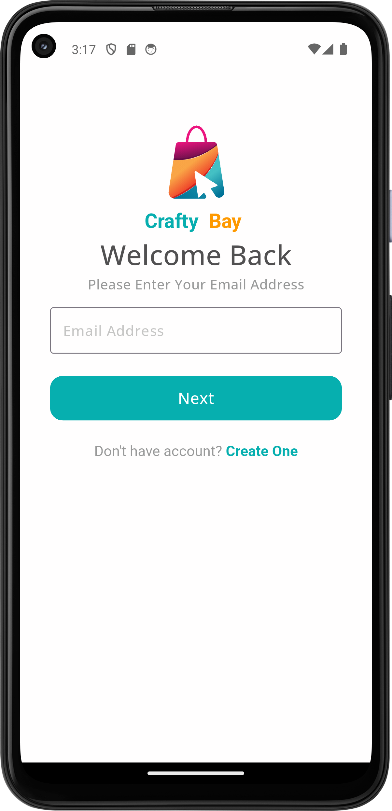
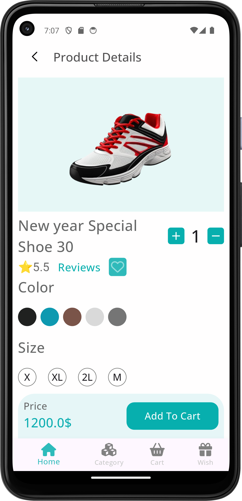

# Craftybay

Craftybay is an innovative e-commerce application built using Flutter. It leverages REST APIs, state management, and MediaQuery for a seamless user experience across various devices. This app provides a user-friendly platform for shopping, browsing categories, viewing product details, and leaving reviews.

---

## Features

- **User Authentication**: Secure login and registration system.
- **OTP Verification**: Ensures user authenticity with an easy-to-use OTP verification system.
- **Home Page**: Displays featured products and highlights categories.
- **Category Browsing**: Explore products by categories with ease.
- **Product Details**: View detailed information about a product, including specifications and pricing.
- **Reviews**: Check and leave reviews for products.
- **Responsive Design**: Adaptive UI using MediaQuery to support different screen sizes.

---

## Screenshots

Below are the key screens of Craftybay:

  
  
  

  
  
  

  

---

## Technologies Used

- **Flutter**: For crafting beautiful and responsive UIs.
- **REST API**: To fetch and send data between the client and the server.
- **State Management**: For efficient app state handling.
- **MediaQuery**: For ensuring the app looks great on all device sizes.

Made by Shadman
